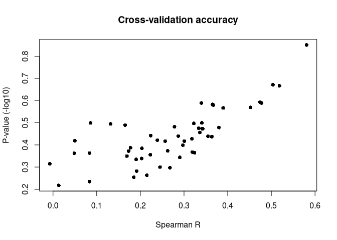
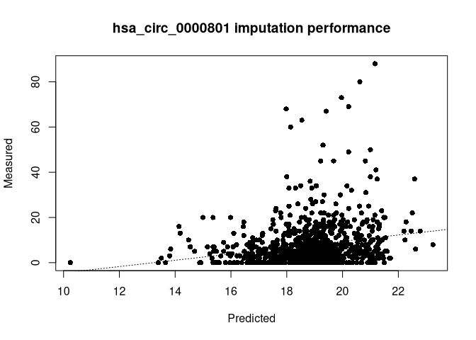

<!-- README.md is generated from README.Rmd. Please edit that file -->

# ICE

<!-- badges: start -->

<!-- badges: end -->

ICE (**I**mpute **C**ircRNA **E**xpression) is designed for imputing
circRNA expression using PCGs (protein-coding genes).

## Installation

> Currently bundled example data may be huge in size. One could try use
> proxy and pull it first.

``` r
remotes::install_github("bioinformatist/ICE")
```

## Quick start

### `library()` package and load example data

``` r
library(ICE)
data("mionco.circ")
# Not in package up to now. Please follow section below to generate this dataset
data("mionco.pcg")
```

### Perform cross-validation analysis to determine the expected accuracy of imputing a circRNA of interest using the training datasets

``` r
(cv.circ <- ICE_cv(train.pcg = mionco.pcg, train.circ = mionco.circ, gene.index="hsa_circ_0000801"))
#> 
#> Running 10-folds cross-validation...
#> Iteration 1
#> Iteration 2
#> Iteration 3
#> Iteration 4
#> Iteration 5
#> Iteration 6
#> Iteration 7
#> Iteration 8
#> Iteration 9
#> Iteration 10
#> Cross-validation complete
#>             PCC      P-Value      RMSE
#>  [1,] 0.3733098 4.696102e-04 10.692914
#>  [2,] 0.5613556 2.780094e-08  5.548638
#>  [3,] 0.3292772 2.225004e-03  6.811714
#>  [4,] 0.4831332 3.243019e-06 10.464265
#>  [5,] 0.4401538 2.794478e-05  9.144700
#>  [6,] 0.3978292 1.786365e-04  8.737620
#>  [7,] 0.3871327 2.748662e-04  8.462851
#>  [8,] 0.2717528 1.239881e-02  9.911899
#>  [9,] 0.3668547 5.982701e-04 10.213629
#> [10,] 0.4159487 8.320301e-05 10.029521
```

### Perform cross-validation analysis to determine the expected imputation accuracy of entire circRNA dataset

``` r
# Use a small part of example circRNA expression data
sample.sub <- sample(rownames(mionco.pcg), size = 100)
cv.full <- ICE_cv_entire(train.pcg = mionco.pcg[sample.sub, ], train.circ = mionco.circ[sample.sub, 1:300])
#> Warning in cor(train.pcg, train.circ[, gene.index]): the standard deviation is
#> zero

#> Warning in cor(train.pcg, train.circ[, gene.index]): the standard deviation is
#> zero
#> 
#> Running 10-folds cross-validation...
#> Iteration 1
#> Iteration 2
#> Iteration 3
#> Iteration 4
#> Iteration 5
#> Iteration 6
#> Iteration 7
#> Iteration 8
#> Iteration 9
#> Iteration 10
#> Cross-validation complete
#> [1] 1
#> Warning in cor(train.pcg, train.circ[, gene.index]): the standard deviation is
#> zero

#> Warning in cor(train.pcg, train.circ[, gene.index]): the standard deviation is
#> zero
#> 
#> Running 10-folds cross-validation...
#> Iteration 1
#> Iteration 2
#> Iteration 3
#> Iteration 4
#> Iteration 5
#> Iteration 6
#> Iteration 7
#> Iteration 8
#> Iteration 9
#> Iteration 10
#> Cross-validation complete
#> [1] 2
#> Warning in cor(train.pcg, train.circ[, gene.index]): the standard deviation is
#> zero
#> 
#> Running 10-folds cross-validation...
#> Iteration 1
#> Iteration 2
#> Iteration 3
#> Iteration 4
#> Iteration 5
#> Iteration 6
#> Iteration 7
#> Iteration 8
#> Iteration 9
#> Iteration 10
#> Cross-validation complete
#> [1] 3
plot(cv.full[,1], -log10(cv.full[,2]), xlab = "Spearman R", ylab = "P-value (-log10)", pch = 16, main = "Cross-validation accuracy")
abline(h = -log10(0.05), lty = 3)
```



``` r
# Find out which miRNAs were imputed with better accuracy 
colnames(mionco.circ)[which(cv.full[,1] > 0.5)]
#> [1] "hsa_circ_0000175" "hsa_circ_0000370" "hsa_circ_0000870"
colnames(mionco.circ)[which(cv.full[,2] < 0.05)]
#> character(0)
```

### Impute expression of certain circRNA(s) of interest with new dataset

> I use the same dataset as *new* dataset for a temporary show, as it
> will be replaced once we have another pair of
data.

``` r
(pred.circ <- ICE(train.pcg = mionco.pcg, train.circ = mionco.circ, new.pcg = mionco.pcg, gene.index = "hsa_circ_0000801"))
#>   [1] 19.04 18.26 18.32 15.16 18.80 18.72 10.24 20.22 16.94 19.24 18.14 18.24
#>  [13] 17.34 19.22 19.02 18.86 18.08 17.86 19.38 18.68 19.04 20.62 18.88 18.38
#>  [25] 20.96 19.26 18.52 17.36 18.84 18.96 19.20 21.26 19.10 17.76 16.20 21.04
#>  [37] 16.90 20.18 18.02 19.44 16.46 18.16 19.00 19.98 18.44 19.30 19.60 17.54
#>  [49] 16.12 18.36 17.98 19.34 16.78 17.12 18.12 19.78 19.42 19.64 19.44 21.16
#>  [61] 21.00 18.36 20.58 18.84 19.74 16.66 18.84 19.86 18.64 20.00 15.00 17.86
#>  [73] 19.40 20.14 19.02 19.30 19.62 18.10 17.44 15.36 18.30 19.36 18.30 20.38
#>  [85] 22.20 16.60 19.58 15.38 18.98 18.88 18.72 19.06 19.50 19.46 18.92 18.48
#>  [97] 19.20 20.70 17.60 17.46 15.74 19.72 17.94 19.28 22.24 21.24 16.38 15.74
#> [109] 18.38 15.32 19.54 17.88 18.86 18.80 13.50 17.60 18.66 14.92 20.78 17.56
#> [121] 17.60 20.62 19.42 20.14 15.88 19.08 20.54 20.02 17.58 16.58 20.58 17.24
#> [133] 18.72 17.06 20.86 18.42 20.84 16.78 18.54 15.24 17.26 18.88 19.06 19.42
#> [145] 18.08 19.06 18.36 18.90 17.94 14.90 21.20 19.96 19.90 18.92 20.26 17.14
#> [157] 20.22 17.50 17.02 19.58 20.62 18.74 18.74 21.06 21.06 18.08 15.42 15.42
#> [169] 20.78 20.72 19.16 17.70 18.10 17.90 18.16 16.80 21.30 21.16 21.16 17.84
#> [181] 19.46 19.30 19.30 19.36 19.00 18.08 17.04 15.40 20.14 18.28 16.80 15.98
#> [193] 19.98 20.40 20.62 18.88 19.04 20.16 17.00 17.60 20.46 20.46 18.54 17.20
#> [205] 19.98 17.74 16.46 17.96 19.04 19.58 20.94 18.92 19.02 18.64 18.82 21.08
#> [217] 20.50 18.72 19.22 20.92 19.16 18.44 19.34 19.46 17.02 19.14 14.88 18.90
#> [229] 18.20 18.08 19.50 18.62 22.46 17.78 20.98 18.46 19.62 19.52 17.72 20.90
#> [241] 18.22 17.42 17.14 18.60 18.84 19.02 17.74 17.18 18.24 18.54 17.46 20.30
#> [253] 18.90 21.24 17.88 17.80 19.20 18.88 19.30 18.86 19.28 20.48 17.94 18.06
#> [265] 19.16 19.08 17.76 16.10 18.76 17.86 17.76 19.14 18.64 16.08 18.86 19.14
#> [277] 19.16 19.20 17.96 18.70 18.96 21.10 17.12 19.36 19.12 19.62 18.16 16.64
#> [289] 16.98 17.98 18.08 18.26 20.52 20.52 21.00 21.00 19.24 19.56 16.96 19.98
#> [301] 20.74 19.38 16.20 17.66 18.86 18.94 20.24 19.98 19.64 19.58 18.72 17.94
#> [313] 22.78 19.38 17.98 19.66 19.36 17.16 22.28 21.26 15.48 16.44 18.82 17.50
#> [325] 17.32 20.00 19.74 18.68 18.94 18.64 17.10 21.68 17.02 17.02 18.00 19.26
#> [337] 19.42 17.90 20.54 16.90 20.54 16.66 16.22 17.92 19.68 18.98 18.06 17.16
#> [349] 19.66 20.96 20.48 19.08 19.94 20.18 17.20 15.98 18.80 19.56 19.16 17.50
#> [361] 17.52 18.20 16.96 16.88 20.44 17.54 20.10 18.68 19.34 20.38 19.98 17.88
#> [373] 19.08 19.08 21.42 18.88 18.20 18.90 16.92 19.74 18.90 18.88 19.38 18.32
#> [385] 19.02 18.42 17.02 18.18 18.62 20.48 19.52 19.62 17.66 19.98 19.88 19.14
#> [397] 19.18 17.98 19.62 17.92 20.96 18.48 19.48 18.32 16.98 17.56 16.80 17.40
#> [409] 16.78 16.62 18.12 19.24 20.12 21.44 17.60 18.86 18.72 19.72 18.70 19.38
#> [421] 17.50 17.76 19.32 19.06 17.80 18.66 20.02 18.64 19.76 18.98 18.36 20.16
#> [433] 19.90 17.70 18.32 20.00 19.04 16.46 18.80 21.72 17.66 17.12 19.90 19.48
#> [445] 16.68 18.28 18.34 18.96 19.18 18.78 20.88 15.96 21.38 21.28 18.36 18.34
#> [457] 13.84 19.04 18.54 19.66 20.16 19.06 20.54 16.78 20.86 19.68 18.54 21.52
#> [469] 20.68 19.86 20.42 18.90 19.92 20.00 17.52 19.26 18.82 20.56 20.12 21.28
#> [481] 19.00 19.26 17.62 18.32 14.14 20.70 19.44 20.42 19.22 21.26 20.92 19.06
#> [493] 19.64 19.80 19.56 20.54 19.76 18.06 14.48 19.22 20.76 15.58 21.30 20.60
#> [505] 17.78 18.74 19.46 19.54 15.50 19.18 18.80 21.16 19.64 17.54 16.78 19.90
#> [517] 21.10 21.24 21.60 17.72 17.64 18.56 21.04 19.38 19.34 17.06 18.70 18.34
#> [529] 18.34 18.66 19.18 19.10 16.10 19.76 20.36 13.40 19.72 18.44 18.44 20.52
#> [541] 20.86 15.90 18.80 18.46 20.32 20.32 19.82 16.04 18.50 17.02 18.12 19.50
#> [553] 18.18 23.24 21.32 19.92 21.08 17.88 19.62 22.58 15.36 17.18 16.98 19.34
#> [565] 14.18 18.52 18.38 18.94 19.60 13.80 14.70 20.88 20.82 19.42 18.12 20.96
#> [577] 21.40 20.64 15.58 18.84 17.80 22.62 22.50 18.54 20.92 21.48 20.28 18.62
#> [589] 20.06 18.24 18.36 19.08 19.06 21.30 18.14 16.24 17.38 19.28 19.42 19.38
#> [601] 18.50 20.34 19.38 20.02 19.22 19.30 20.30 18.08 18.78 20.68 21.20 19.20
#> [613] 17.98 16.64 16.70 17.60 17.44 17.66 17.42 18.44 17.88 20.54 16.32 18.92
#> [625] 19.20 18.08 17.86 18.02 21.06 19.10 21.46 18.76 15.36 18.40 18.32 14.54
#> [637] 18.74 17.54 21.52 17.90 18.98 18.94 18.92 17.52 19.70 18.22 18.60 17.98
#> [649] 19.04 18.54 21.32 16.58 17.98 19.32 19.52 19.02 18.34 19.26 19.36 20.78
#> [661] 19.12 19.46 19.18 19.80 19.06 17.98 18.46 20.44 19.98 19.30 20.12 20.82
#> [673] 19.86 19.34 17.10 20.24 18.72 20.12 18.58 17.92 17.62 18.42 17.88 16.70
#> [685] 17.90 15.64 19.78 19.32 20.94 21.50 17.78 17.18 20.62 19.48 17.68 18.32
#> [697] 19.90 16.48 17.80 18.66 18.64 19.98 17.84 17.70 18.18 18.22 18.90 18.48
#> [709] 19.82 19.94 20.04 19.62 18.78 17.88 17.88 18.52 18.32 21.28 18.86 18.22
#> [721] 20.16 19.50 21.54 21.06 17.94 17.62 19.60 17.94 19.28 21.32 17.96 18.40
#> [733] 19.04 21.30 18.90 19.68 17.56 19.78 18.76 19.08 19.72 20.66 18.68 19.40
#> [745] 19.20 16.74 16.66 20.96 20.00 18.88 19.64 18.26 18.74 20.22 20.22 18.72
#> [757] 19.28 19.02 18.78 18.86 19.78 20.68 21.14 19.68 18.16 19.66 20.52 19.48
#> [769] 17.78 17.62 18.32 18.08 18.08 18.82 18.66 17.50 18.90 17.62 18.08 18.84
#> [781] 17.60 18.72 17.22 18.92 18.60 18.64 18.94 18.62 18.84 19.06 16.58 18.84
#> [793] 16.62 18.10 19.20 19.06 18.50 18.78 19.48 19.24 15.38 18.82 18.38 18.64
#> [805] 19.10 19.36 19.06 18.62 18.36 18.38 18.42 18.30 19.16 18.82 18.26 18.68
#> [817] 18.42 18.90 19.00 18.72 19.36 15.80 18.84 18.46 18.26 19.16 19.00 18.74
#> [829] 19.00 17.70 16.52 13.66 18.52 18.40 18.58 19.64 20.84 20.84 20.36 18.40
#> [841] 17.74 18.18
plot(pred.circ, mionco.circ[, "hsa_circ_0000801"], xlab = "Predicted", ylab = "Measured", main = "hsa_circ_0000801 imputation performance", pch = 16)
abline(lm(mionco.circ[, "hsa_circ_0000801"] ~ pred.circ), lty = 3)
```



### Impute expression of all circRNAs available in the training dataset (*To be finished*)

## Example dataset (*To be finished*)

To perform further analysis on circRNAs, we need to convert genome
region (**Chromosome**:**Start**-**End**) to circRNA identifiers
according to [circBase](http://www.circbase.org) records. Besides,
genome assemblies currently used in circBase are hg19 for H. sapiens. To
convert the data between assemblies, one can use liftOver tool at
[UCSC’s web interface](http://genome.ucsc.edu/cgi-bin/hgLiftOver).

One pair of circRNA and PCGs matrices is from paper [*The Landscape of
Circular RNA in
Cancer*](https://www.sciencedirect.com/science/article/pii/S0092867418316350).

circRNA expression matrix was downloaded from [this
website](https://mioncocirc.github.io/download/), and pre-processed by
below code:

``` r
library(data.table)
mionco.circ <- fread('v0.1.release.txt')
bed <- fread('hglft_genome_5d4de_3493b0.bed')
bed <- bed[, 1:4]
setnames(bed, c('chr', 'start', 'end', 'ID'))
mionco.circ <- na.omit(mionco.circ[bed, on = .(chr == chr, start > start, end < end), allow.cartesian=TRUE])
mionco.circ <- dcast(mionco.circ, formula = sample ~ ID, value.var = 'reads', fun.aggregate = max)
mionco.circ <- as.matrix(mionco.circ, rownames = 'sample')

mionco.pcg <- fread('fpkm_matrix.csv', drop = 1)
mionco.pcg[, Row.names := tstrsplit(Row.names, '\\.')[[1]]]
mionco.pcg[, V2 := NULL]
mionco.pcg <- as.matrix(mionco.pcg, rownames = 'Row.names')
mionco.pcg <- t(mionco.pcg)

sample.used <- intersect(rownames(mionco.circ), rownames(mionco.pcg))
mionco.circ <- mionco.circ[sample.used, ]
mionco.pcg <- mionco.pcg[sample.used, ]
```

## TODO list

  - \[ \] Add: new test datasets (also make adjustment for gene IDs)
  - \[ \] Subset: we do **NOT** need such a big training dataset
  - \[ \] Refactor: rewrite cv process with `caret`?
  - \[ \] Refactor: rewrite type check for satisfying the Bioc’s?
  - \[ \] Fix: warning `In cor(train.pcg, train.circ[, gene.index]) :
    the standard deviation is zero`
  - \[ \] Vignette: replace plots with `ggplot2` and add other examples
  - \[ \] Application: on TCGA datasets? Artificial datasets? Others?
